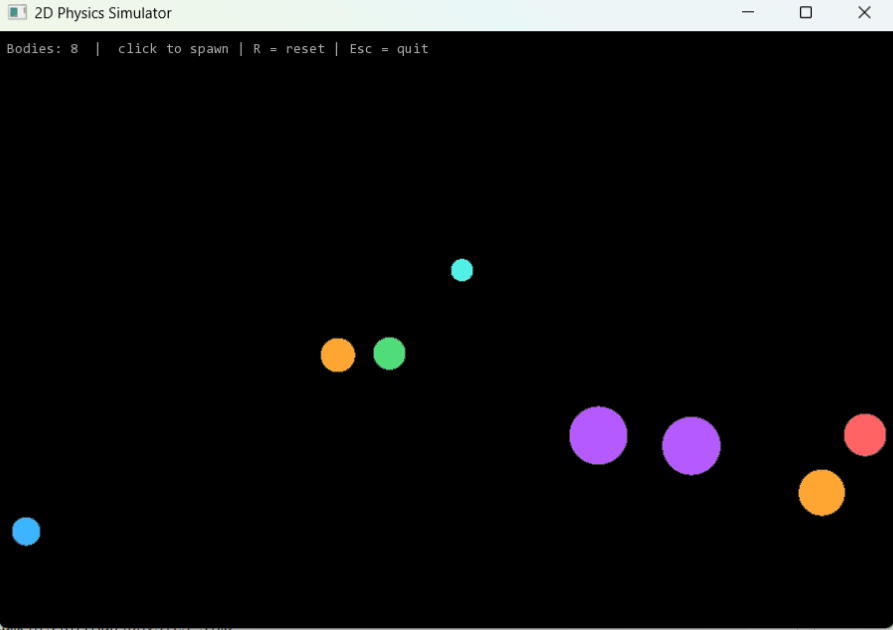

# 2D Physics Simulator

A real-time 2D rigid-body physics engine written in C++ using SFML for rendering. Demonstrates particle simulation with circle–circle collision detection, impulse-based collision resolution, and a fixed-timestep game loop.



---

## Features

| Feature | Implementation |
|---|---|
| Entity system | `Entity` class — position, velocity, acceleration, mass, restitution |
| Numerical integration | **Semi-implicit (symplectic) Euler** — more energy-stable than explicit Euler |
| Collision detection | **Circle–circle** narrow phase (O(n²), sufficient for ~100 bodies) |
| Collision resolution | **Impulse-based** with Baumgarte positional correction to prevent sinking |
| Boundary handling | AABB wall/floor/ceiling constraints with restitution + friction |
| Game loop | **Fixed-timestep** at 60 Hz with frame-time accumulator and spiral-of-death guard |

---

## Build & Run (Windows)

**Requirements:** MSYS2 with MinGW x64

**Step 1 — Install MSYS2**

Download and install from https://www.msys2.org

**Step 2 — Open the right terminal**

From the Start Menu, open **MSYS2 MinGW x64** (not MSYS2 MSYS or UCRT64).

**Step 3 — Install the compiler and SFML**

```bash
pacman -S mingw-w64-x86_64-gcc mingw-w64-x86_64-sfml
```

**Step 4 — Navigate to the project**

```bash
cd /c/Users/YourName/Desktop/physics-sim   # adjust to wherever you extracted it
```

**Step 5 — Build**

```bash
g++ -std=c++17 -O2 -Iinclude src/main.cpp -o physics_sim -lsfml-graphics -lsfml-window -lsfml-system
```

**Step 6 — Run**

```bash
./physics_sim.exe
```

### Controls

| Input | Action |
|---|---|
| **Left click** | Spawn a ball at cursor position |
| **R** | Reset simulation |
| **Esc** | Quit |
